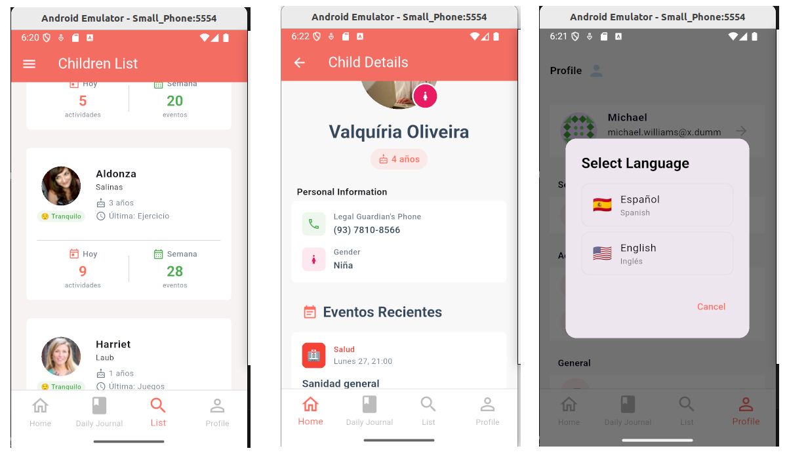
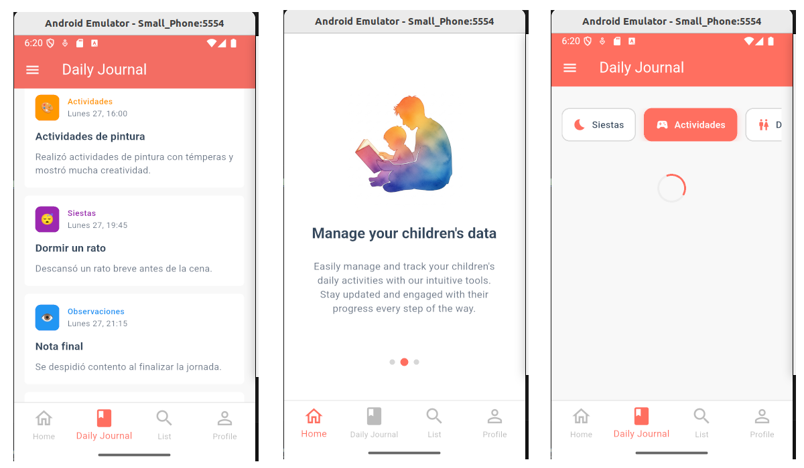
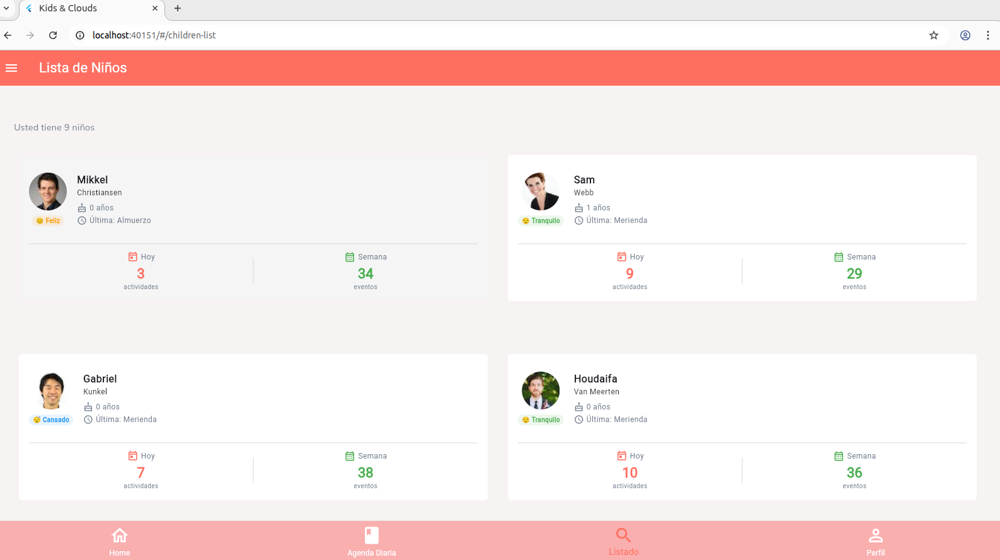

# Prueba Técnica Kids & Clouds

Una aplicación Flutter responsive para la gestión y seguimiento del cuidado infantil, disponible tanto para dispositivos móviles como para web.


# Arquitectura de la aplicación

Arquitectura base del proyecto (MVVM) separado en:

- **core:** para los elementos comunes de toda la aplicación.
- **feature:** En este tenemos una feature única llamada kidsandclouds. Aunque en un proyecto de mayor tamaño podríamos haber creado varias features (por ejemplo: auth, kids, journal...).


```
/lib
├── core/
│   ├── theme/
│   ├── helper/
│   ├── navigation/
│   ├── widgets/
│   └── di/
├── kidsandclouds/
│   ├── data/
│   │   ├── models/
│   │   ├── services/
│   │   └── repositories/
│   ├── domain/
│   │   ├── repositories/
│   │   └── usecases/
│   └── presentation/
│       ├── providers/
│       ├── screens/
│       └── widgets/
├── generated/
│   └── l10n.dart
└── main.dart
```


- **data**: Representa nuestra estructura de datos y la conexión a la API. En este caso, y siguiendo las convenciones de Flutter, Kotlin y desarrollo para mobile, utilizamos la capa de 'services' para lanzar las peticiones de https. Mientras que usamos los repositories para la obtención de datos (por ejemplo, en nuestro caso hay datos que obtenemos de ficheros json).
  
- **domain**: En este caso puede estar añadiendo una capa de complejidad innecesaria a la arquitectura, ya que apenas hay reglas de uso en la aplicación (aunque se aplican en un par de ocasiones para filtrar los datos). Por su parte, utilizamos interfaces para los repositories y así asegurarnos de que en cualquier momento nuestros casos de uso pueden cambiar la fuente de datos sin comprometer el funcionamiento de la aplicación.
  
- **presentation**: capa visual, con las pantallas (screens), componentes reutilizables (widgets) y gestores de estado (provider). 


## Librerías utilizadas

Para el proyecto se han utilizado las siguientes librerías:

- **goRouter:** Para la navegación dentro de la aplicación. 
- **Riverpod:** Como provider y para el sistema de inyección de dependencias. 
- **Intl:** Para poder cambiar de idioma. 
- **Flutter Secure Storage:**  Para guardar el access token y el refresh token (sí, recibimos un token de la Api de prueba).
- **Json annotation:**  Nos facilita métodos para hacer las conversiones dentro de los modelos.
- **Retrofit + Dio:** estas dos librerías combinadas hacen más legibles las peticiones a la API. Luego de hacer cualquier cambio en un modelo o el servicio, será necesario ejecutar este comando:

```
  flutter pub run build_runner build --delete-conflicting-outputs
```

Además, se utilizan interceptos para simplificar las peticiones https y añadir encabezados personalizados (como por ejemplo, el access token que habíamos recuperado de la APi). Sin entrar en mucho detalle, guardamos el token en el Secure Storage y a partir de ahí queda añadido automáticamente. También aprovechamos para guardar algunas constantes como la baseUrl.


# Presentación

Visualmente, la aplicación se compone de un total de 6 pantallas:

- Login
- Home (que en realidad funcionaría como un Splash).
- Lista de eventos.
- Children List
- Child Detail
- Settings

Todas las pantallas se han hecho responsive. La estrategia en este caso ha sido adaptar los widgets a un tipo de pantalla u otra dependiendo del contexto de la aplicación, manteniendo siempre una parte común para cada pantalla (generlamente los títulos y el scaffold principal), y cambiar la "parte variable" (es decir, de qué manera se muestran las listas de items). Más concretamente, se ha apostado por un grid para la versión desktop y por una lista simple para la versión mobile. 

## Pantallas versión móvil




Igualmente, se han hecho ciertas mejoras visuales sobre los requerimentos originales del ejercicio. Por ejemplo, en lugar de utilizar un selector desplegable para seleccionar un hijo, se ha optado por una barra de búsqueda que permite filtrar a través del provider.

Otras mejoras incluyen una bottomBar, una appBar (con opción de abrir el drawer) y una navegación completa que permite no solo navegar hacia adelante, sino hacer pop hacia atrás.


## Pantallas versión web




# Tests unitarios (3 tests)

Para la realización de test unitarios hemos tomado dos referentes:
- EventRepository.
- EventCard.

## Test lógico (repository)
En el caso de EventRepository testamos los dos métodos disponibles (obtener todos los eventos y filtrarlos). Puesto que en el test no podemos acceder directamente a la carpeta assets, mockeamos un JSON desde el setUP. Una vez mockeado, ahora sí que es posible testar que los datos se están recibiendo o filtrando correctamente.  

## Test visual (widget)
Para el test visual hemos seleccionado el widget EventCard. Aquí nuevamente mockeamos un evento que vamos a psar como parámetro al widget y utilizamos pumpWidget para simular la renderización de dicho componente. Acto seguido, comenzamos el test y "recorremos" el widget completo buscando las palabras clave que nos interesa y que deberían estar dentro del evento mockeado anteriormente.


# Uso de la aplicación

El apk se ha añadido a la raíz del proyecto para evitar cualquier problema relacionado con las dependencias. Es posible instalarlo directamente en un dispositivo móvil (android) o en un emulador de la siguiente manera:

```
# Arrancar cualquiera de los emuladores instalados y que esté corriendo, luego ejecutar:

adb install ./release/app-release.apk
adb shell am start -n com.example.pruebakidsandclouds/.MainActivity


# Ejecutar directamente para navegador
cd ./release/web
python3 -m http.server 3000
```


## Login

Para hacer login en la aplicación basta con usar algunas de las credenciales válidas de la API gratuita dummyjson:

- https://dummyjson.com/docs/auth


Se puede usar la credencial que viene hardcodeada dentro de la aplicación o emplear cualquiera de las que facilita la API en este enlace: https://dummyjson.com/users

**Por ejemplo**

```
 username: 'emilys'
 password: 'emilyspass'


username: 'sophiab'
password: 'sophiabpass'

```


#  Instalación 

## Requisitos previos

### Flutter SDK
- **Flutter 3.16.0 o superior**
- **Dart 3.2.0 o superior**

### Para desarrollo web:
- **Google Chrome** (para testing web)


### 1. Verificar instalación de Flutter
```bash
flutter doctor

# Clonar repositorio
git clone [[URL_DEL_REPOSITORIO](https://github.com/fjzamora93/prueba_tecnica_flutter)]
cd pruebakidsandclouds

# isntalar dependencias
flutter pub get

#! IMPORTANTE: generar archivos de código
dart run build_runner build --delete-conflicting-outputs

```

### 2. Ejecución de dispositivos:

```bash
# Ver dispositivos disponibles
flutter devices
flutter run -d [DEVICE_ID]

# Ejecutar en Chrome
flutter run -d chrome

```

### Generar APK

```bash
flutter build apk --release
```

### Generar tests

```bash
flutter test
```

